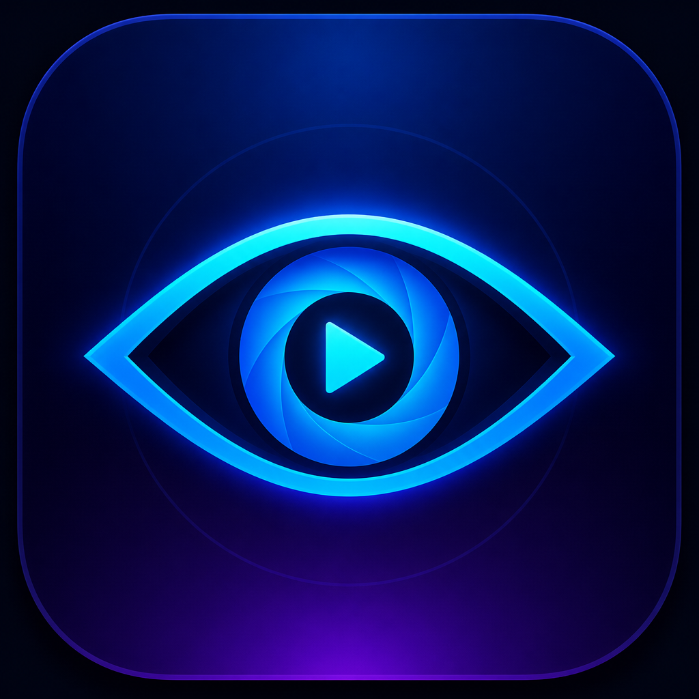

<p align="center">
  
</p>

# Argus

One place for every stream.

Argus is a React Native app that connects to streaming providers through **plugins**—Netflix, Prime Video, NHL, and more—and presents series, movies, and live events in a single experience. Browse, search, and watch without jumping between apps.

Think of it like [Kodi](https://kodi.tv/) for modern streaming: a thin client core, with content and auth living in plugins.

## Goals

- **Unified library** — one browse/search surface across providers
- **All media types** — movies, series (seasons/episodes), live events, and channels over time
- **Plugin-based providers** — each service is a plugin, not hard-coded into the app
- **Public and private plugin repos** — community and first-party catalogs, plus private/local sources (Kodi-style)
- **Cross-platform** — React Native as the client foundation (mobile first; other targets TBD)

## Non-goals (for now)

- Implementing provider plugins or DRM playback in this repo until the plugin contract exists
- Bundling credentials or reverse-engineered APIs for commercial services
- Shipping a finished plugin marketplace on day one

## Architecture (intended)

```
┌─────────────────────────────────────────┐
│              Argus app (RN)             │
│  UI · player shell · search · library   │
└─────────────────┬───────────────────────┘
                  │ plugin API (TBD)
┌─────────────────▼───────────────────────┐
│     Provider plugins (per service)      │
│  auth · catalog · resolve stream · live │
└─────────────────┬───────────────────────┘
                  │
┌─────────────────▼───────────────────────┐
│     Plugin repositories (public/private)│
│  discover · install · update · trust    │
└─────────────────────────────────────────┘
```

### Core app

Owns navigation, UX, library aggregation, player shell, settings, and plugin lifecycle (install, enable, update, permissions). It should stay provider-agnostic.

### Plugins

Each provider plugin is responsible for:

- Authentication / session (where applicable)
- Catalog (titles, seasons, episodes, live schedules)
- Search and metadata normalization into Argus types
- Stream / playback URL resolution (or deep-link handoff, depending on feasibility)
- Live events and channels when the provider supports them

### Plugin repositories

Similar to Kodi add-on repos:

| Kind | Purpose |
|------|---------|
| **Public** | Curated / community catalogs people can install from |
| **Private** | Personal, enterprise, or unpublished sources |

Repo details (signing, trust, update channels) are **open design questions**—see [docs/DEVELOPMENT.md](docs/DEVELOPMENT.md).

## Status

**Phase 2 in progress** — Expo SDK 57 TV app scaffolded (`with-router-tv` + `react-native-tvos@0.86-stable`). Plugin contract shipped as `@argus-tv/plugin-sdk@0.1.0` (Phase 1 complete). See [docs/IMPLEMENTATION-PLAN.md](docs/IMPLEMENTATION-PLAN.md).

## Development

Prerequisites: Node.js 22+, Xcode 16+ (tvOS), Android Studio Iguana+ (Android TV).

```bash
npm ci
npm run prebuild:tv   # EXPO_TV=1 — generates tvOS + Android TV native projects
npm run ios           # Apple TV simulator
npm run android       # Android TV emulator
```

TV builds use [`@react-native-tvos/config-tv`](https://github.com/react-native-tvos/config-tv) and the `EXPO_TV=1` env var (set automatically by `prebuild:tv` and EAS `*_tv` profiles in `eas.json`).

### VS Code / Cursor

Install the recommended [**Expo Tools**](https://marketplace.visualstudio.com/items?itemName=expo.vscode-expo) extension (`.vscode/extensions.json`).

| Action | How |
|--------|-----|
| Start Metro | **Run Task → Start Metro** |
| Prebuild | **Run Task → Prebuild** (once, before first native run) |
| Run Apple TV | **Run Task → Run Apple TV** |
| Run Android TV | **Run Task → Run Android TV** |
| Physical TV device | `npm run start:device` |
| Debug | **Run and Debug → Debug Apple TV** or **Debug Android TV** |
| Attach only | **Run and Debug → Attach** |

### CI / releases

| Action | How |
|--------|-----|
| PR checks | `ci.yml` — typecheck + lint |
| Version bump | `npm run changeset` → merge **chore: version packages** PR → `argus@<version>` tag |
| Build host app | Tag push (`preview_tv` APK) or **Actions → Build host app** — profiles: `preview_tv` / `staging_tv` / `production_tv`; enable **Submit to store tracks** for staging/production store release |

One-time: `eas init` + **`EXPO_TOKEN`** — see [docs/PACKAGING.md](docs/PACKAGING.md#one-time-setup-host-app). Staging also needs Apple + Google developer accounts — [staging setup](docs/PACKAGING.md#staging-store-tracks-developers-only).

## Development

Prerequisites: Node.js 22+, Xcode 16+ (tvOS), Android Studio Iguana+ (Android TV).

```bash
npm ci
npm run prebuild:tv   # EXPO_TV=1 — generates tvOS + Android TV native projects
npm run ios           # Apple TV simulator
npm run android       # Android TV emulator
```

TV builds use [`@react-native-tvos/config-tv`](https://github.com/react-native-tvos/config-tv) and the `EXPO_TV=1` env var (set automatically by `prebuild:tv` and EAS `*_tv` profiles in `eas.json`).

## Docs

| Doc | What it covers |
|-----|----------------|
| [docs/VISION.md](docs/VISION.md) | Product vision and principles |
| [docs/ARCHITECTURE.md](docs/ARCHITECTURE.md) | Technical architecture, diagrams, plugin/repo/DRM design |
| [docs/IMPLEMENTATION-PLAN.md](docs/IMPLEMENTATION-PLAN.md) | Living step-by-step build plan (updated as we implement) |
| [docs/PACKAGING.md](docs/PACKAGING.md) | How the app is built, distributed to test devices, and built in CI |
| [docs/DEVELOPMENT.md](docs/DEVELOPMENT.md) | How we plan to build Argus |
| [docs/PLUGIN-SYSTEM.md](docs/PLUGIN-SYSTEM.md) | Plugin design goals and open questions |
| [AGENTS.md](AGENTS.md) | Guidance for coding agents |

## License

TBD.
