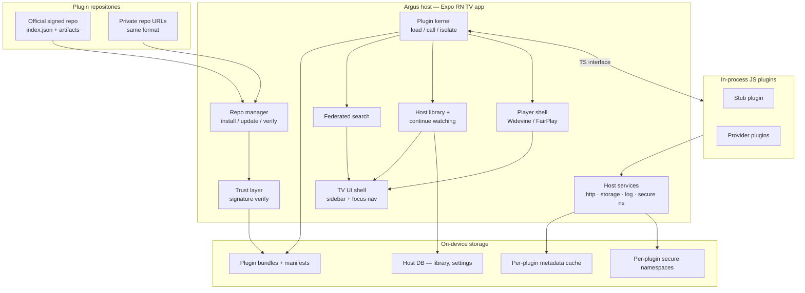
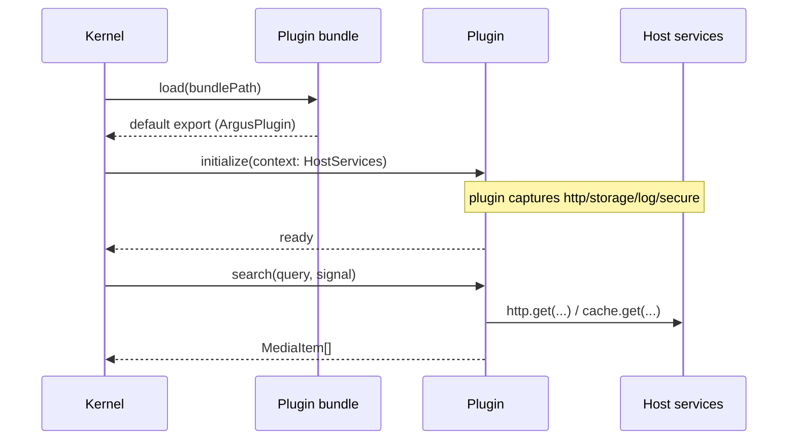
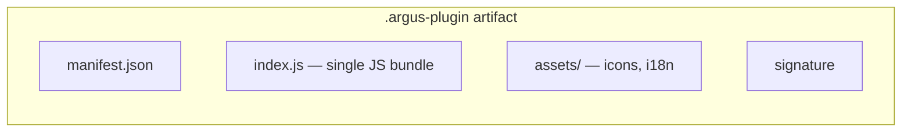
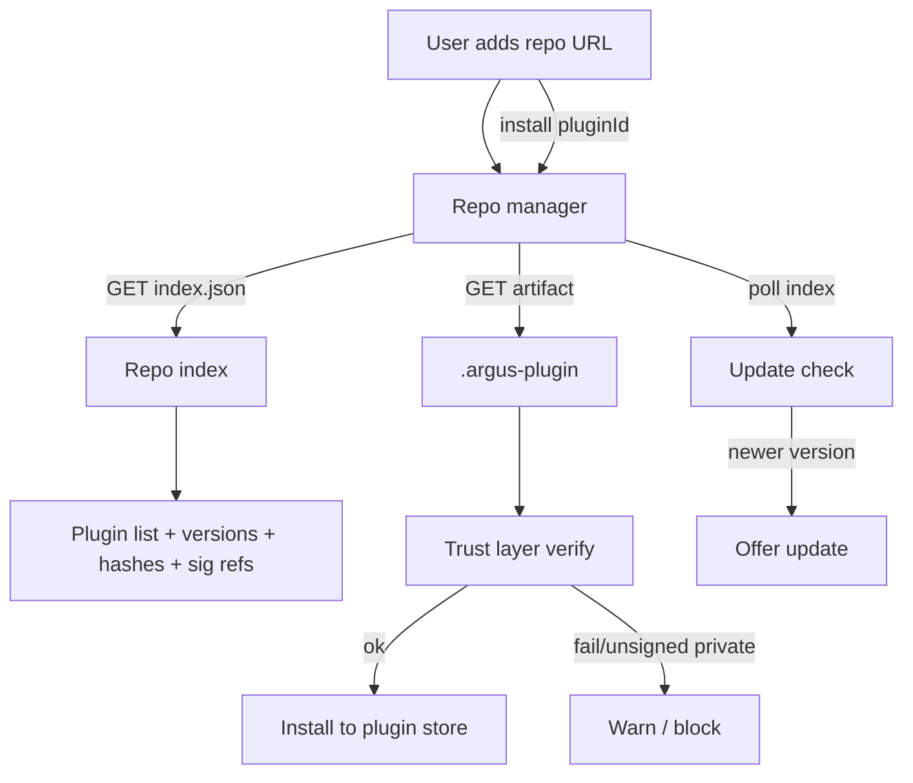
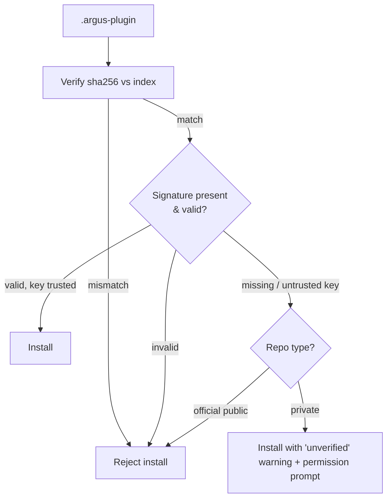
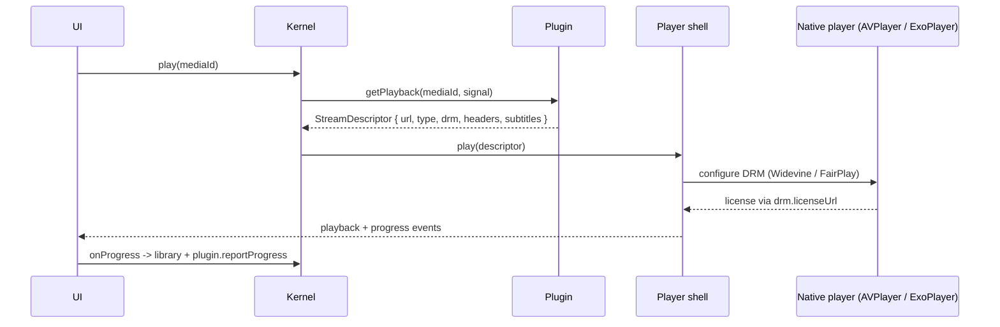
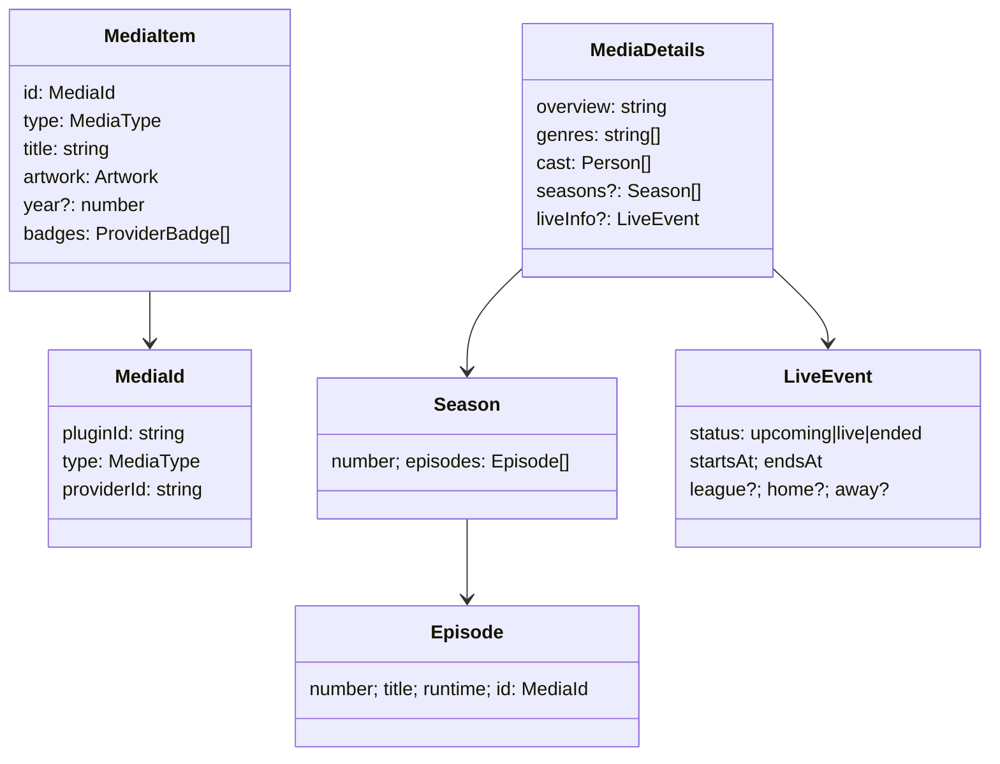
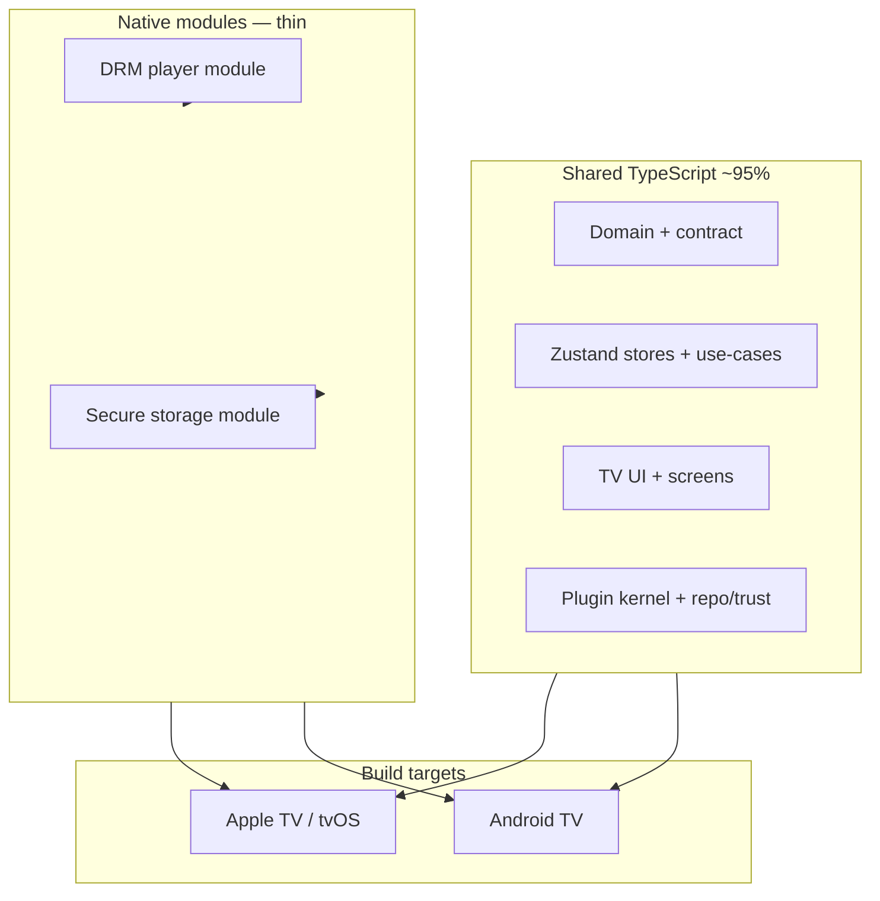
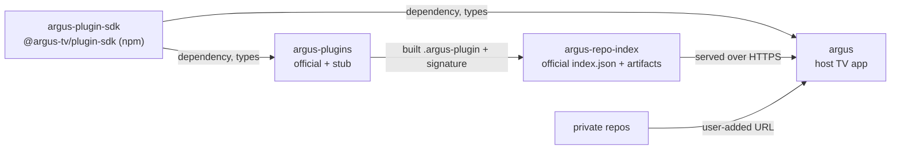

# Argus architecture

This document describes the intended architecture of Argus based on decisions made during planning. It is the primary technical reference for the host app, plugin system, and repository system.

Diagrams use [Mermaid](https://mermaid.js.org/). Anything marked **(default)** was chosen by the architecture to keep momentum and can be revisited via an ADR.

## Reading order

1. [Decisions](#locked-decisions) — what is settled
2. [System overview](#system-overview) — the big picture
3. [Host architecture](#host-architecture) — the RN TV app
4. [Plugin system](#plugin-system) — contract, packaging, runtime
5. [Repository system](#repository-system) — discovery, install, update
6. [Trust & signing](#trust--signing)
7. [Playback & DRM](#playback--drm)
8. [Data model](#data-model)
9. [Platform modules](#platform-modules)
10. [Repository topology](#repository-topology-multi-repo)
11. [Cross-cutting concerns](#cross-cutting-concerns)
12. [Open questions & ADR backlog](#open-questions--adr-backlog)

---

## Locked decisions

| Area | Decision |
|------|----------|
| v1 platforms | Apple TV (tvOS) + Android TV |
| v1 playback | In-app player with DRM (Widevine / FairPlay) |
| v1 providers | Stub / fixture plugins only until the contract is proven |
| Plugin runtime | JavaScript / TypeScript, in-process ([ADR 0001](adr/0001-plugin-contract-ts-interfaces.md)) |
| Plugin API style | TypeScript interfaces — host calls a typed object directly ([ADR 0001](adr/0001-plugin-contract-ts-interfaces.md)) |
| Plugin updates | Hot-download bundles from repos (no app-store release required for JS-only changes) |
| Repositories | Official repo + user-added private repo URLs from day one |
| Trust | Signed plugins required on the official public repo; private repos install with a user warning |
| Code layout | Multi-repo from the start: host, SDK, plugins, repo index are separate ([ADR 0002](adr/0002-multi-repo-layout.md)) |
| Auth storage | Per-plugin secure-storage namespace |
| Search | Federated, parallel queries across enabled plugins |
| Live vs VOD | Equal priority in the media model and UI |
| Library | Host favorites / continue-watching **and** per-plugin sync when available |
| Cache | Plugins own their catalog / metadata cache |
| TV navigation | Sidebar / rail (Netflix-style) |
| RN toolchain | Expo + dev client |
| TV UI / focus | Native `react-native-tvos` focus + thin host wrappers ([ADR 0004](adr/0004-tv-ui-focus.md)) |
| State management | Zustand |
| Team | Solo / small — optimize for speed and low ops overhead |

---

## System overview



**Principle:** the host is provider-agnostic. It knows how to load plugins, call a typed contract, aggregate normalized results, and play a resolved stream. All provider knowledge lives in plugins.

---

## Host architecture

The host is a single Expo React Native app targeting tvOS and Android TV. Business logic is plain TypeScript modules; RN is the delivery shell.

```mermaid
flowchart LR
  subgraph presentation [Presentation]
    Screens[Screens: Home, Search, Detail, Player, Library, Settings]
    Focus[Focus / spatial nav]
    Comp[TV components]
  end
  subgraph application [Application / state — Zustand]
    SearchStore[search store]
    LibraryStore[library store]
    PluginStore[plugin registry store]
    PlayerStore[player store]
  end
  subgraph domain [Domain — provider-agnostic]
    Model[Media model + DTOs]
    Contract[Plugin contract types]
    Aggregate[Aggregation / dedup / ranking]
  end
  subgraph platform [Platform / infrastructure]
    Kernel[Plugin kernel]
    RepoMgr[Repo manager]
    Trust[Trust / signing]
    HostSvc[Host services]
    Native[Native modules: player, keychain, DRM]
  end

  presentation --> application --> domain
  application --> platform
  platform --> domain
```



### Layers

Host source layout (Phase 2a):

| Layer | Path |
|-------|------|
| Presentation | `src/presentation/` (components, hooks, constants) |
| Application | `src/application/stores/` (Zustand) |
| Domain | `src/domain/` (host domain helpers; media DTOs remain in `@argus-tv/plugin-sdk`) |
| Platform | `src/platform/` (e.g. `focus/` — [ADR 0004](adr/0004-tv-ui-focus.md)) |
| Routes | `src/app/` (Expo Router; thin imports into presentation) |

- **Presentation** — screens, TV components, and focus management. No provider or plugin knowledge; renders domain DTOs.
- **Application / state** — Zustand stores orchestrating use-cases (run a search, install a plugin, resume playback). Thin; delegates to domain + platform.
- **Domain** — the media model, the plugin contract types, and aggregation logic (merge/dedup/rank federated results). Pure TypeScript, unit-testable, no RN imports.
- **Platform / infrastructure** — plugin kernel, repo manager, trust layer, host services, and native modules (player/DRM/keychain).

### Key host modules

| Module | Responsibility |
|--------|----------------|
| **Plugin kernel** | Load/enable/disable plugins, hold instances, invoke contract methods with timeouts + error boundaries, per-plugin circuit breaker |
| **Repo manager** | Fetch repo indexes, resolve versions, download bundles, trigger verification, install/update/remove |
| **Trust layer** | Verify signatures against known keys; gate install; surface warnings for unsigned/private |
| **Host services** | Services injected into plugins: HTTP client, structured logger, per-plugin secure storage, per-plugin cache/KV, image helper |
| **Search aggregator** | Fan out `search()` to enabled plugins in parallel, stream partial results, apply timeout + dedup |
| **Library service** | Host favorites/continue-watching in local DB; reconcile with plugin-reported progress |
| **Player shell** | Take a `StreamDescriptor`, configure DRM, drive the native player, report progress |

---

## Plugin system

### Runtime model

Plugins are **in-process JS/TS**. Each plugin exports a default object implementing the `ArgusPlugin` interface. The kernel imports the bundle, instantiates it, and calls typed methods directly.



**Isolation strategy (default).** In-process JS has weak isolation, so the kernel compensates:

- Every contract call is wrapped with a **timeout** and try/catch **error boundary**.
- An `AbortSignal` is passed to cancellable calls.
- A **circuit breaker** disables a plugin after N consecutive failures/crashes and prompts the user.
- Plugins receive only the **host services** object — no direct access to host internals or other plugins’ namespaces.
- Long term, the runtime can move to an isolated context (worker/WebView) behind the same contract; this is an [open question](#open-questions--adr-backlog).

### Plugin contract (v0 sketch)

The exact types live in the SDK (`@argus-tv/plugin-sdk`). Sketch:

```typescript
export interface ArgusPlugin {
  readonly manifest: PluginManifest;

  initialize(ctx: HostContext): Promise<void>;
  dispose?(): Promise<void>;

  // Capability-gated; presence implies support, also declared in manifest.
  search?(query: string, opts: SearchOptions, signal: AbortSignal): Promise<MediaItem[]>;
  getHomeRows?(signal: AbortSignal): Promise<Row[]>;
  getDetails?(id: MediaId, signal: AbortSignal): Promise<MediaDetails>;
  getPlayback?(id: MediaId, signal: AbortSignal): Promise<StreamDescriptor>;
  getLive?(signal: AbortSignal): Promise<LiveEvent[]>;

  // Auth (capability-gated)
  getAuthState?(): Promise<AuthState>;
  login?(flow: LoginFlow): Promise<AuthState>;
  logout?(): Promise<void>;

  // Library (capability-gated)
  getContinueWatching?(signal: AbortSignal): Promise<Progress[]>;
  reportProgress?(p: Progress): Promise<void>;
}

export interface HostContext {
  http: HttpClient;          // host-provided fetch with timeout/retry
  secureStore: SecureStore;  // per-plugin secure namespace
  cache: KeyValueStore;      // per-plugin metadata cache
  log: Logger;               // structured, forwarded to host
  settings: SettingsAccess;  // reads user-set plugin settings
}
```

Contract rules (defaults):

- **All methods async** (Promise-returning); no sync path in v0.
- **Capabilities** are declared in the manifest *and* implied by method presence; the host trusts the manifest for UI and validates at call time.
- **Timeouts (default):** search 5s, details 8s, playback resolve 30s, home rows 8s.
- **Cancellation:** host passes `AbortSignal`; plugins should honor it.
- **Error taxonomy (default):** plugins throw/return typed errors — `AUTH_REQUIRED`, `GEO_BLOCKED`, `NOT_AVAILABLE`, `DRM_UNSUPPORTED`, `RATE_LIMITED`, `PLUGIN_ERROR`.
- **Settings schema:** plugin declares a JSON Schema in its manifest; host renders the settings form.
- **API version:** manifest declares `apiVersion`; host refuses incompatible majors.

### Packaging



- **Format (default):** a zip named `*.argus-plugin` containing `manifest.json`, a single pre-bundled `index.js`, optional `assets/`, and a detached signature.
- **Entry point:** `index.js` default-exports the `ArgusPlugin` object.
- **Dependencies:** plugins bundle their own deps; the SDK types are `devDependencies` only (no runtime SDK coupling in v0).
- **Native code in plugins:** **not allowed in v1** (JS-only), which keeps hot-update viable and store-safe.

### Manifest (sketch)

```json
{
  "id": "com.example.provider",
  "name": "Example Provider",
  "version": "1.2.0",
  "apiVersion": "0.1",
  "entry": "index.js",
  "capabilities": ["search", "catalog", "vod", "live", "auth", "library"],
  "permissions": ["network", "secureStorage"],
  "settingsSchema": { "type": "object", "properties": {} },
  "platforms": ["tvos", "androidtv"],
  "icon": "assets/icon.png"
}
```

---

## Repository system

A repository is a URL serving a machine-readable index plus downloadable artifacts. Public/official and private repos use the **same format**; the only difference is trust handling.



### Index format (default)

Single `index.json` per repo (paginate later if needed):

```json
{
  "repo": {
    "id": "argus-official",
    "name": "Argus Official",
    "signingKey": "ed25519:BASE64_PUBLIC_KEY"
  },
  "plugins": [
    {
      "id": "com.example.provider",
      "name": "Example Provider",
      "versions": [
        {
          "version": "1.2.0",
          "apiVersion": "0.1",
          "platforms": ["tvos", "androidtv"],
          "url": "https://.../example-1.2.0.argus-plugin",
          "sha256": "…",
          "signature": "…"
        }
      ]
    }
  ]
}
```

Repo system rules (defaults):

- **Artifact hosting:** anywhere HTTPS-reachable (GitHub Releases, S3, static host). The index points to absolute URLs.
- **Private repo auth (default):** optional bearer token stored with the repo entry; secret-URL also works.
- **Channels:** single channel in v1; `stable`/`beta` deferred.
- **Conflicts:** if two repos expose the same `pluginId`, the user chooses the source; the host records the origin.
- **Rollback:** the index lists multiple versions so users can pin/install an older one.
- **Dependency plugins:** deferred to a later version (v1 plugins are self-contained).
- **Offline / sideload:** installing a local `.argus-plugin` file is supported for plugin authors.

---

## Trust & signing



- **Algorithm (default):** Ed25519 detached signatures over the artifact bytes.
- **Official plugins:** signed in CI with a project key; the public key is embedded in the app and also published in the repo index.
- **Public repo:** unsigned or invalid signatures are **rejected**.
- **Private repo:** unsigned allowed with a clear **"unverified"** badge and a permission prompt.
- **Permissions:** shown at install time based on `manifest.permissions` (e.g. `network`, `secureStorage`).
- **Revocation:** a simple version blocklist in the official index (deferred but designed for).

---

## Playback & DRM

The player shell is host-owned; plugins only **resolve** what to play.



`StreamDescriptor` (sketch):

```typescript
interface StreamDescriptor {
  url: string;
  type: "hls" | "dash" | "mp4";
  drm?: {
    scheme: "widevine" | "fairplay";
    licenseUrl: string;
    certificateUrl?: string;   // FairPlay
    headers?: Record<string, string>;
  };
  headers?: Record<string, string>;
  subtitles?: { url: string; lang: string; format: "vtt" | "srt" }[];
  live?: boolean;
  startPosition?: number;
}
```

Defaults / decisions to confirm:

- **Player module:** **`expo-video`** (AVPlayer / ExoPlayer), host-owned chrome — [ADR 0006](adr/0006-player-expo-video.md). FairPlay/Widevine still need a device spike (Phase 2b). HLS playlist rewrite for plugins is a host transport concern (local proxy / `VideoAssetTransportProvider`), not baked into the player package.
- **Stream types (default):** HLS + DASH + progressive MP4.
- **Quality:** ABR auto with an optional manual picker.
- **Live (default):** live-edge in v1; DVR/start-over later.
- **DRM failure (default):** show a clear error; deep-link fallback only if the plugin advertises `deepLink`.
- **Player features v1 (default):** resume position, next episode, subtitle + audio track selection. Skip-intro deferred.

> DRM on tvOS + Android TV under Expo is the highest-risk area. It gets an early spike ([plan phase 2b](IMPLEMENTATION-PLAN.md)).

---

## Data model

Provider-agnostic DTOs the UI renders and plugins produce. Live and VOD are first-class.



- **Media types:** `movie`, `series`, `season`, `episode`, `liveEvent`, `channel` (channel may land later).
- **Global ID (default):** structured `MediaId = { pluginId, type, providerId }`, renderable as `argus://pluginId/type/providerId`.
- **Cross-provider dedup (default):** show once with "available on" badges when a confident match exists; otherwise show separately. Aggregation lives in the domain layer.
- **Artwork (default):** plugin supplies URLs; host may cache but does not proxy in v1.
- **Continue watching source of truth (default):** merge — the max progress across host and plugin wins.

---

## Platform modules



- **Shared code (default):** ~95% TypeScript; native only where unavoidable — the DRM player and secure storage.
- **Focus / spatial navigation:** native `react-native-tvos` primitives (`TVFocusGuideView`, Pressable focus), wrapped in `src/platform/focus/` and presentation TV components ([ADR 0004](adr/0004-tv-ui-focus.md)).
- **Input:** D-pad first; gamepad/mouse on Android TV is a nice-to-have.
- **Platform integrations** (top shelf, Leanback recommendations): deferred past v1.
- **Expo:** `expo-dev-client` + `expo-video` config plugin (prebuild) — [ADR 0006](adr/0006-player-expo-video.md).

---

## Repository topology

**Separate repositories from day one** — see [ADR 0002](adr/0002-multi-repo-layout.md). No monorepo phase.



| Repo | Purpose | Notes |
|------|---------|-------|
| `argus` (this repo) | Host TV app (Expo RN) + docs | Consumes `@argus-tv/plugin-sdk` |
| `argus-plugin-sdk` | Contract types, manifest schema, contract tests, plugin template | Published as `@argus-tv/plugin-sdk` |
| `argus-plugins` | Official + stub/reference plugins | Builds signed `.argus-plugin` artifacts |
| `argus-repo-index` | Official `index.json` + hosted artifacts | GitHub Pages / Releases / static host |

`argus-plugin-sdk` is created first (Phase 1) so the host and plugins depend on a real, versioned contract. During early local iteration the host/plugins may consume the SDK via a git dependency or `npm link` before it is published.

---

## Cross-cutting concerns

- **State:** Zustand stores per concern (search, library, plugins, player); domain logic stays outside stores for testability.
- **Errors:** typed error taxonomy across the plugin boundary; user-facing messages mapped in the host.
- **Logging:** plugin `log` calls forwarded to the host console (structured); remote logging deferred.
- **Crash reporting (default):** host-only (e.g. Sentry) later; not required for the first spikes.
- **Analytics:** none in v1 (privacy-first).
- **Testing:** domain + contract unit tests; contract fixture tests shared from the SDK; host integration test loading the stub plugin.
- **i18n / a11y (default):** structure for i18n from the start (string catalog), full localization deferred; respect platform screen readers.
- **Security:** per-plugin secure namespaces, permission prompts, signature verification, no secrets in git.

---

## Open questions & ADR backlog

Decisions above marked **(default)** are provisional. These warrant an ADR under `docs/adr/` when tackled. Priority order:

1. **DRM player spike** — prove FairPlay + Widevine on device with `expo-video` ([ADR 0006](adr/0006-player-expo-video.md)); fall back only if the spike fails.
2. **Hot-update & store policy** — what OTA plugin delivery is acceptable on the App Store / Play.
3. **Repo index & signing format** — finalize `index.json` schema + Ed25519 signing/verification flow.
4. **Plugin runtime isolation** — upgrade from in-process if crash containment is insufficient ([ADR 0001](adr/0001-plugin-contract-ts-interfaces.md) documents v1 choice).
5. **Media aggregation** — cross-provider dedup/matching strategy and identifiers.
6. **Continue-watching reconciliation** — precise merge semantics across host and plugins.

**Accepted ADRs:** [0001](adr/0001-plugin-contract-ts-interfaces.md) (plugin contract & runtime), [0002](adr/0002-multi-repo-layout.md) (multi-repo layout), [0003](adr/0003-app-versioning.md) (host versioning), [0004](adr/0004-tv-ui-focus.md) (TV focus), [0006](adr/0006-player-expo-video.md) (player shell).

Each resolved ADR should update the relevant section here and the [implementation plan](IMPLEMENTATION-PLAN.md).
