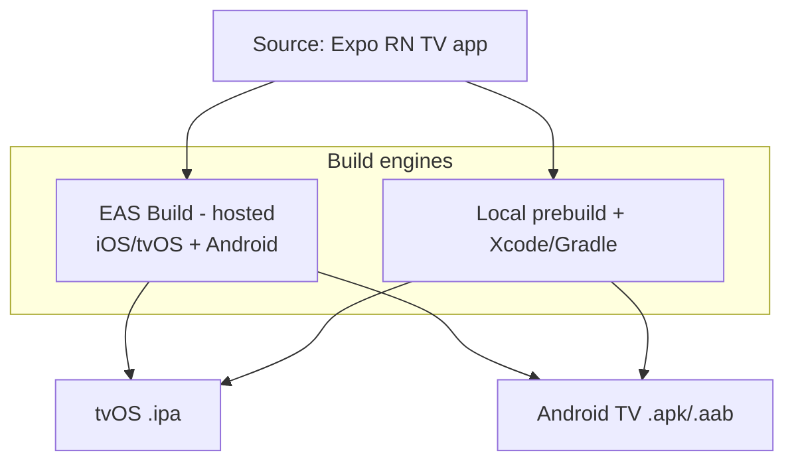
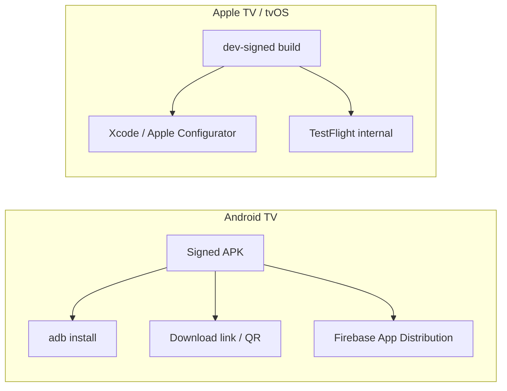
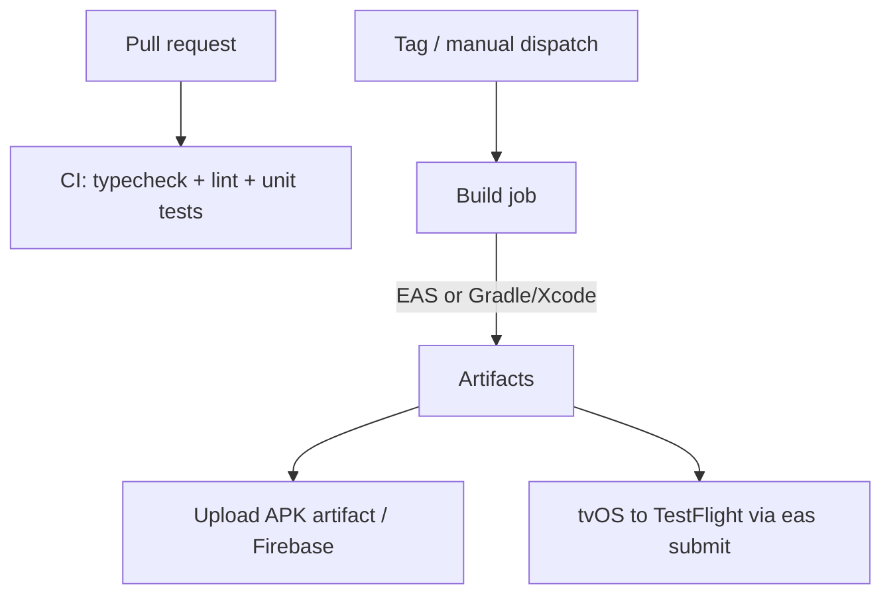

# Packaging, builds & distribution

How Argus is built and delivered to devices. Scope for now: **private developers only** — no public store release. We still need repeatable builds, a way to install on real Apple TV + Android TV hardware, and automated builds in GitHub Actions.

Complements [ARCHITECTURE.md](ARCHITECTURE.md) (what the app is) and [IMPLEMENTATION-PLAN.md](IMPLEMENTATION-PLAN.md) (build order). Items marked **(default)** are provisional and can change via an ADR.

> Note: this is mainly about shipping the **host app**. Two related-but-separate distribution tracks:
> - **Plugin packaging/distribution** (`.argus-plugin`, repo index) — see [ARCHITECTURE.md](ARCHITECTURE.md#repository-system).
> - **The SDK npm package** (`@argus-tv/plugin-sdk`) — see [SDK npm package](#sdk-npm-package-argus-tvplugin-sdk) below.

## Goals

- Reproducible builds for **tvOS** and **Android TV** from one codebase
- Easy install on developer devices for testing (no public store)
- Automated builds on **GitHub Actions**, non-interactive, secrets-driven
- A path that scales later to TestFlight/Play internal tracks without rework

## Constraints & context

- Stack: **Expo + dev client**, `react-native-tvos` (TV support), TypeScript.
- Targets: **Apple TV (tvOS)** and **Android TV**.
- tvOS builds require **macOS + Xcode + an Apple Developer Program membership** ($99/yr) and code-signing assets. Android has no such gate.
- Apple TV **cannot** install arbitrary APK-style files: apps arrive via **Xcode/Apple Configurator (dev-signed)** or **TestFlight**. Android TV installs a plain **APK** (`adb install`, file manager, or a distribution service).

---

## Build approach

Two viable engines. **Default: EAS Build** (Expo's hosted build service) to avoid managing Xcode signing and macOS runners ourselves; keep local/prebuild as the escape hatch.



### Option A — EAS Build (default)

- One CLI (`eas build`) produces tvOS and Android TV artifacts; handles credentials/signing.
- Runs fine from GitHub Actions with an `EXPO_TOKEN` (no macOS runner needed — builds happen on Expo infra).
- Cost/quota: free tier is limited; TV + frequent CI may need a paid plan — **decision to confirm**.
- Requires `eas.json` build profiles.

### Option B — Local / self-hosted builds

- `expo prebuild` then native builds: **Gradle** for Android (works on Linux runners), **Xcode** for tvOS (needs a macOS runner + manual signing setup).
- No Expo quota; more maintenance (certs, provisioning, Xcode versions on runners).
- Good fallback for Android APKs even if we use EAS for tvOS.

### Build profiles (`eas.json`, sketch)

```jsonc
{
  "build": {
    "development": {            // dev client, for day-to-day device testing
      "developmentClient": true,
      "distribution": "internal",
      "android": { "buildType": "apk" }
    },
    "preview": {                // release-like, internal testers
      "distribution": "internal",
      "android": { "buildType": "apk" },
      "ios": { "simulator": false }
    },
    "production": {             // future: store/TestFlight/Play tracks
      "distribution": "store"
    }
  }
}
```

---

## Distribution to developer devices (private)



### Android TV (easy)

- **Primary (default):** build a signed **APK**, install via `adb install app.apk` over the network (Android TV → enable developer mode + ADB debugging).
- **Convenience:** distribute the APK link/QR (EAS internal distribution) or **Firebase App Distribution** for tester management and update notifications.
- Keep a single **upload keystore** as a CI secret so every build is install-over-install compatible.

### Apple TV / tvOS (gated)

- **Requires** Apple Developer Program membership + registered **device UDIDs** for ad-hoc, or an internal **TestFlight** group.
- **Default:** use **TestFlight internal testing** — simplest way to get builds onto real Apple TVs without wiring each device, and it scales to more testers later.
- **Alternative:** ad-hoc dev-signed build installed via **Xcode** or **Apple Configurator** (needs each Apple TV's UDID registered; install is cabled/paired).
- Simulator builds (tvOS Simulator) are fine for fast iteration and need no signing.

### Reality check for "private developers only"

- Android: fully self-serve, no accounts, no cost.
- tvOS: you need the paid Apple account and App Store Connect app record even for private TestFlight. There is no true "sideload an IPA on Apple TV" path comparable to Android. Plan around TestFlight from the start.

---

## GitHub Actions



### Workflows (planned)

1. **`ci.yml`** — on PR: install, typecheck, lint, unit tests (Linux runner, cheap, no native build).
2. **`build-android.yml`** — on tag/dispatch: build signed Android TV APK.
   - Path A (default): `eas build -p android --profile preview --non-interactive` with `EXPO_TOKEN`.
   - Path B: Gradle build on `ubuntu-latest`, sign with keystore secret, upload APK artifact / push to Firebase App Distribution.
3. **`build-tvos.yml`** — on tag/dispatch: build + optionally submit tvOS.
   - Path A (default): `eas build -p ios --profile preview` then `eas submit -p ios` to TestFlight (uses Expo infra; no macOS runner needed).
   - Path B: `macos-latest` runner + Xcode + `fastlane`/manual signing (more setup).

### Secrets needed

| Secret | Used for |
|--------|----------|
| `EXPO_TOKEN` | Non-interactive EAS build/submit |
| `ANDROID_KEYSTORE_BASE64`, `ANDROID_KEYSTORE_PASSWORD`, `ANDROID_KEY_ALIAS`, `ANDROID_KEY_PASSWORD` | Signing Android TV APK (Path B / local signing) |
| `APPLE_APP_STORE_CONNECT_API_KEY` (+ issuer/key id) | `eas submit` / fastlane to TestFlight |
| `FIREBASE_APP_ID`, `FIREBASE_TOKEN` (optional) | Firebase App Distribution for Android testers |

Store all in GitHub Actions secrets; never commit them (matches the no-secrets-in-git rule).

### Versioning builds

- **App version** from `app.json`/`app.config.ts`; auto-increment **build number** in CI (EAS `autoIncrement` or a CI step).
- Tag releases (e.g. `v0.1.0`) to trigger build workflows; attach artifacts to the GitHub Release for Android.

---

## SDK npm package (`@argus-tv/plugin-sdk`)

The plugin contract ships as a versioned npm package that the host and every
plugin depend on. It lives in the `argus-plugin-sdk` repo and is **types-first**
(no runtime SDK coupling; consumers bundle their own deps).

### Versioning & release (automated)

- **Tooling:** [Changesets](https://github.com/changesets/changesets) drives
  semver bumps + `CHANGELOG.md`; GitHub Actions publishes.
- **Flow:** author adds a changeset (`npm run changeset`) → push to `main`
  opens a **"Version Packages"** PR → merging it **publishes to npm**.
- **Provenance:** published with npm [provenance](https://docs.npmjs.com/generating-provenance-statements)
  via OIDC (`id-token: write`), so the registry links each release to the
  building workflow + commit.
- **Dist-tag:** while the contract is `0.x` it publishes under the **`next`**
  tag (`npm i @argus-tv/plugin-sdk@next`); `latest` is reserved for the first
  stable `1.0.0`. Stabilizing means removing `publishConfig.tag` and bumping.
- **Local iteration:** before/around publishing, the host and plugins can
  consume the SDK via `npm link` or a git dependency ([ADR 0002](adr/0002-multi-repo-layout.md)).

### Workflows (in `argus-plugin-sdk`)

1. **`ci.yml`** — on PR/push: `npm ci`, `typecheck`, `build`.
2. **`release.yml`** — on push to `main`: `changesets/action` opens the version
   PR or publishes when one is merged.

### Secrets & one-time setup

| Secret / setting | Used for |
|------------------|----------|
| `NPM_TOKEN` | Granular **automation** token scoped to the `@argus-tv` org, used by `release.yml` to publish |
| *Settings → Actions → General* | Enable **"Allow GitHub Actions to create and approve pull requests"** so the Version Packages PR can be opened |

> The `@argus-tv` npm org is owned by the project. `publishConfig.access` is
> `public` so the scoped package is publicly installable.

---

## Recommended path (v0)

For a solo/private setup optimizing for speed:

1. **Android TV first** — local/EAS APK, `adb install` to a real device. Zero account friction; validates the app + DRM spike quickly.
2. **Add EAS + `EXPO_TOKEN`** and a `build-android.yml` producing a downloadable APK artifact on tag.
3. **Apple TV** — enroll in Apple Developer Program, set up TestFlight internal, use `eas build` + `eas submit` from Actions.
4. **Optional:** Firebase App Distribution once there is more than one Android tester.

---

## Decisions to confirm

- [ ] **EAS vs self-hosted** builds (default: EAS; revisit on cost/quota).
- [ ] **Apple Developer Program** enrollment + who owns the account/team.
- [ ] **tvOS distribution:** TestFlight (default) vs ad-hoc + Apple Configurator.
- [ ] **Android tester distribution:** raw APK/`adb` (default) vs Firebase App Distribution.
- [ ] **APK vs AAB** for Android internal (APK is simpler for sideload; AAB needed only for Play).

Turn confirmed choices into an ADR (`docs/adr/`) and update the build tasks in [IMPLEMENTATION-PLAN.md](IMPLEMENTATION-PLAN.md).

## Out of scope (for now)

- Public App Store / Play Store release and review
- Auto-update of the host app (Android in-app updates, App Store phased release)
- OTA JS updates for the host (Expo Updates) — revisit alongside plugin hot-update policy
