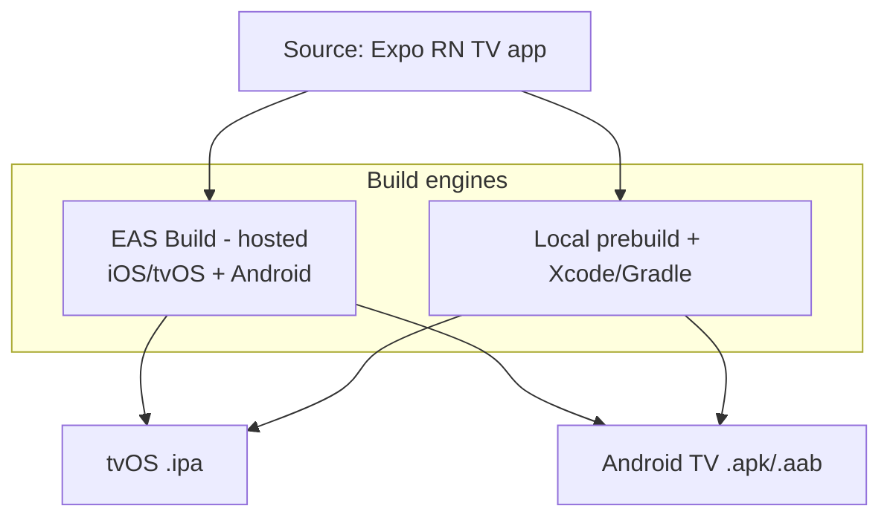
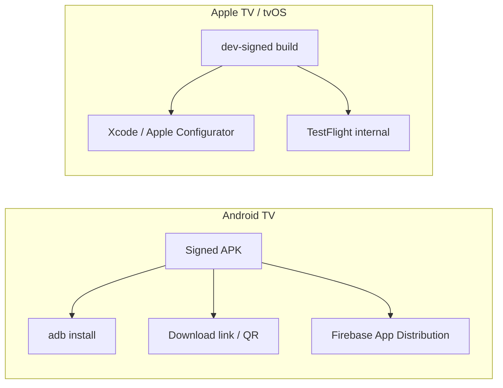
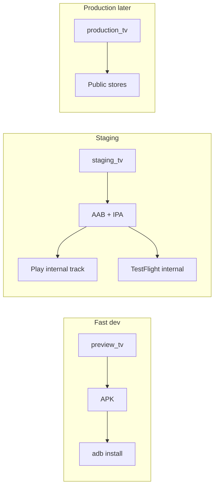

# Packaging, builds & distribution

How Argus is built and delivered to devices. Scope for now: **private developers only** — no public store release. We still need repeatable builds, a way to install on real Apple TV + Android TV hardware, and automated builds in GitHub Actions.

Complements [ARCHITECTURE.md](ARCHITECTURE.md) (what the app is) and [IMPLEMENTATION-PLAN.md](IMPLEMENTATION-PLAN.md) (build order). Items marked **(default)** are provisional and can change via an ADR.

> Note: this is mainly about shipping the **host app**. Two related-but-separate distribution tracks:
> - **Plugin packaging/distribution** (`.argus-plugin`, repo index) — see [ARCHITECTURE.md](ARCHITECTURE.md#repository-system).
> - **The SDK npm package** (`@argus-tv/plugin-sdk`) — see [SDK npm package](#sdk-npm-package-argus-tvplugin-sdk) below.

## Goals

- Reproducible builds for **tvOS** and **Android TV** from one codebase
- Easy install on developer devices for testing (no public store)
- Automated builds on **GitHub Actions**, non-interactive, secrets-driven
- A path that scales later to TestFlight/Play internal tracks without rework

## Constraints & context

- Stack: **Expo + dev client**, `react-native-tvos` (TV support), TypeScript.
- **Player:** `expo-video` via the official Expo config plugin in `app.json` — [ADR 0006](adr/0006-player-expo-video.md). Adding or upgrading it requires a **native rebuild** (`npm run prebuild:tv` then `npm run ios` / EAS), not a JS-only reload.
- Targets: **Apple TV (tvOS)** and **Android TV**.
- tvOS builds require **macOS + Xcode + an Apple Developer Program membership** ($99/yr) and code-signing assets. Android has no such gate.
- Apple TV **cannot** install arbitrary APK-style files: apps arrive via **Xcode/Apple Configurator (dev-signed)** or **TestFlight**. Android TV installs a plain **APK** (`adb install`, file manager, or a distribution service).

---

## Build approach

Two viable engines. **Default: EAS Build** (Expo's hosted build service) to avoid managing Xcode signing and macOS runners ourselves; keep local/prebuild as the escape hatch.



### Option A — EAS Build (default)

- One CLI (`eas build`) produces tvOS and Android TV artifacts; handles credentials/signing.
- Runs fine from GitHub Actions with an `EXPO_TOKEN` (no macOS runner needed — builds happen on Expo infra).
- Cost/quota: free tier is limited; TV + frequent CI may need a paid plan — **decision to confirm**.
- Requires `eas.json` build profiles.

### Option B — Local / self-hosted builds

- `expo prebuild` then native builds: **Gradle** for Android (works on Linux runners), **Xcode** for tvOS (needs a macOS runner + manual signing setup).
- No Expo quota; more maintenance (certs, provisioning, Xcode versions on runners).
- Good fallback for Android APKs even if we use EAS for tvOS.

### Build profiles (`eas.json`)

| Profile | Use | Android artifact | Store submit |
|---------|-----|------------------|--------------|
| `preview_tv` | Fast dev / CI tags | APK (`adb install`) | No |
| `staging_tv` | Developer-only store testing | AAB | TestFlight internal + Play **internal** |
| `production_tv` | Public release (later) | AAB | TestFlight + Play **production** |

`staging_tv` extends `production_tv` with `channel: "staging"` (for future EAS Update). Both store profiles use `distribution: "store"` and a signed upload keystore (EAS-managed by default).

Submit profiles in `eas.json`:

```jsonc
"submit": {
  "staging": {
    "android": { "track": "internal", "releaseStatus": "completed" },
    "ios": { "ascAppId": "6791784830" }
  },
  "production": {
    "android": { "track": "production" },
    "ios": { "ascAppId": "6791784830" }
  }
}
```

---

## Distribution to developer devices (private)



### Android TV (easy)

- **Primary (default):** build a signed **APK**, install via `adb install app.apk` over the network (Android TV → enable developer mode + ADB debugging).
- **Convenience:** distribute the APK link/QR (EAS internal distribution) or **Firebase App Distribution** for tester management and update notifications.
- Keep a single **upload keystore** as a CI secret so every build is install-over-install compatible.

### Apple TV / tvOS (gated)

- **Requires** Apple Developer Program membership + registered **device UDIDs** for ad-hoc, or an internal **TestFlight** group.
- **Default:** use **TestFlight internal testing** — simplest way to get builds onto real Apple TVs without wiring each device, and it scales to more testers later.
- **Alternative:** ad-hoc dev-signed build installed via **Xcode** or **Apple Configurator** (needs each Apple TV's UDID registered; install is cabled/paired).
- Simulator builds (tvOS Simulator) are fine for fast iteration and need no signing.

> **tvOS submit gotcha — `eas submit` delivers tvOS as iOS (do not use it for tvOS).** App Store Connect processing rejects the Apple TV binary with `ITMS-90508` (`DTPlatformName` invalid), `90545` (profile "not compatible with iOS apps"), `90713`/`90039` (iOS icon keys) — all symptoms of Apple validating a tvOS binary **as iOS**. The binary is correct (`DTPlatformName=appletvos`, `UIDeviceFamily=[3]`, `CFBundleSupportedPlatforms=[AppleTVOS]`, tvOS App Store profile), so the binary is **not** the cause — verified by stripping `LSRequiresIPhoneOS` and still getting identical errors on build 10. The cause is the **delivery**: `eas submit -p ios` tags the upload as the iOS platform (there is no tvOS platform in `eas submit`; it's a known tooling gap — Expo [#29604](https://github.com/expo/expo/issues/29604), and the delivery `app_platform=ios` problem from [fastlane/pilot #92](https://github.com/fastlane/pilot/issues/92)).
>
> **Fix (proven & automated):** upload the EAS-built IPA with **`xcrun altool --upload-app -t appletvos`** on macOS — the `-t appletvos` flag makes Apple validate as tvOS. This was confirmed by re-uploading the *same* rejected build 10 IPA: `VERIFY SUCCEEDED` then `UPLOAD SUCCEEDED with no errors`. CI does this automatically in the **`submit-tvos`** job (`macos-latest`) of `build-host.yml`; `eas submit` is used for **Android only**.
>
> ```bash
> # Manual equivalent (macOS + Xcode), .p8 in ~/private_keys/AuthKey_<KEY_ID>.p8:
> xcrun altool --upload-app -f argus-tvos.ipa -t appletvos \
>   --apiKey <KEY_ID> --apiIssuer <ISSUER_ID>
> ```
>
> Alternative for one-off manual uploads: **Transporter.app** (Mac App Store) auto-detects `appletvos` from the bundle. Reference: [Expo tvOS → TestFlight walkthrough](https://dev.to/desertskylabs/how-i-got-an-expo-tvos-app-to-testflight-from-windows-without-buying-a-mac-first-358p).
>
> Also required once: the ASC app must include the **tvOS** platform (App Store Connect → app → **Add Platform → tvOS**), and the EAS provisioning profile must be `tvOS App Store` type (EAS creates this automatically when `EXPO_TV=1`).

### Reality check for "private developers only"

- **Android (preview):** fully self-serve via APK/`adb`, no accounts, no cost.
- **Android (staging):** Google Play Developer account ($25 one-time) + Play Console app + internal testing track; testers install from Play Store on the TV.
- **tvOS:** Apple Developer Program ($99/yr) + App Store Connect app record. **TestFlight internal** is the default staging path — no public App Store listing.

---

## Staging (store tracks, developers only)

Store-signed builds for invited testers only — the “real” install flow without going public.



| Platform | Staging install | Who |
|----------|-----------------|-----|
| **Android TV** | Google Play **internal testing** — invite emails in Play Console | Testers you add |
| **Apple TV** | **TestFlight internal** — App Store Connect users on your team | Up to ~100 internal testers |

**CI:** **Actions → Build host app** → profile `staging_tv` → enable **Submit to store internal/production tracks**. Android goes to **Play internal** via `eas submit --profile staging`; tvOS goes to **TestFlight** via the `submit-tvos` job (`xcrun altool -t appletvos` on `macos-latest`) — see the tvOS submit gotcha above.

**One-time setup (staging):**

1. **Apple** — [Apple Developer Program](https://developer.apple.com/programs/) enrolled; App Store Connect app for `net.oxoc.argus` (`ascAppId` `6791784830` in `eas.json`) with the **tvOS platform added**. Run `eas credentials` for iOS **build** signing (distribution cert + `tvOS App Store` profile). Create an **App Store Connect API Key** (Users and Access → Integrations → App Store Connect API; role App Manager) and add three repo secrets — `ASC_API_KEY_ID`, `ASC_API_ISSUER_ID`, `ASC_API_KEY_P8` (the `.p8` contents) — used by the `submit-tvos` altool job.
2. **Google** — [Play Console](https://play.google.com/console) developer account, create the Android TV app, upload a Google **service account key** via `eas credentials` (Android → Google Service Account).
3. **First `staging_tv` build** — EAS will prompt for (or generate) an Android **upload keystore** on the first store build; credentials are stored on Expo.
4. **Invite testers** — Play Console → Internal testing → testers; App Store Connect → TestFlight → Internal Testing group.

Tag pushes still default to `preview_tv` (APK artifacts). Use manual dispatch for staging store submits.

---

## GitHub Actions


### Workflows

1. **`ci.yml`** — on PR + push to `main`: `npm ci`, typecheck, lint.
2. **`release.yml`** — on push to `main`: Changesets version PR or `argus@<version>` git tag ([ADR 0003](adr/0003-app-versioning.md)).
3. **`build-host.yml`** — on `argus@*` tag or manual dispatch: EAS `preview_tv` / `staging_tv` / `production_tv` for Android TV + tvOS → workflow artifacts + GitHub Release; optional store submit on dispatch (Android via `eas submit`; tvOS via the `submit-tvos` altool job → TestFlight internal).

**Lockfile note:** `@emnapi/core` / `@emnapi/runtime` are pinned in `overrides` and listed as `devDependencies` so `npm ci` stays consistent on macOS (local + EAS) and Linux CI. A plain `npm install` on Darwin can otherwise drop those optional transitive entries while leaving the overrides in place, which makes EAS fail with `Missing: @emnapi/* from lock file`. After changing deps, run `npm ci` (not only `npm install`) before pushing.

**App / TV icons:** vector source is `assets/brand/icon-mark.svg` (also rendered in-app via `BrandMarkSvg` / `react-native-svg`). Warm stone vertical gradient (`#F3EEE6` → `#E8E2D8` → `#D4C9B8`) + ink mark `#1C1E24` — set in `scripts/generate-icons.mjs`. Regenerate with `npm run icons:generate`. Outputs: `assets/brand/` masters, `assets/images/` (app icon, adaptive, splash, favicon), `assets/tv_icons/` (opaque RGB). Splash / adaptive solid fallback stays `#E8E2D8`. `appleTVImages` in `app.json` feed an Xcode image stack — the **Back** layer must be fully opaque (no alpha); Apple applies the TV mask.

```mermaid
flowchart LR
  PR[Pull request] --> CI[ci.yml]
  Main[Push to main] --> Release[release.yml]
  Release -->|merge version PR| Tag[argus@version tag]
  Tag --> Build[build-host.yml]
  Build --> APK[APK + IPA artifacts + Release]
```

### One-time setup (host app)

Before the first EAS build from CI:

1. **Expo account** — `npx expo login` (or `logout` then `login` if the SDK 57 session bug appears).
2. **Link the EAS project** — from the repo root:

   ```bash
   eas init
   ```

   This adds `extra.eas.projectId` to the app config (commit the change). Required for `appVersionSource: remote` and hosted builds.

3. **GitHub secret** — create an [Expo access token](https://expo.dev/accounts/[account]/settings/access-tokens) and add **`EXPO_TOKEN`** under the repo's Actions secrets.

4. **Manual smoke build** (recommended once):

   ```bash
   eas build -p android --profile preview_tv
   ```

   Confirms TV native project + credentials before relying on CI.

5. **tvOS / TestFlight** (when you need a physical Apple TV):
   - Apple Developer Program + App Store Connect app record **with the tvOS platform added**
   - Apple **build** credentials stored in EAS (`eas credentials`) — distribution cert + `tvOS App Store` profile
   - ASC API Key secrets in the repo (`ASC_API_KEY_ID`, `ASC_API_ISSUER_ID`, `ASC_API_KEY_P8`) for the altool submit job
   - Run **Build host app** with profile **`staging_tv`** + **Submit to store tracks** (the `submit-tvos` job uploads via `altool -t appletvos`). Do **not** use `eas submit` for tvOS — see the gotcha above.

6. **Android TV / Play internal** (store install without public release):
   - Google Play Developer account + Play Console app
   - Google service account key in EAS (`eas credentials`)
   - Run **Build host app** with profile **`staging_tv`** + **Submit to store tracks**

### Secrets

| Secret | Used for |
|--------|----------|
| `EXPO_TOKEN` | Non-interactive EAS build/submit |
| EAS-managed credentials (dashboard / `eas credentials`) | Apple signing, Android upload keystore, Google Play service account |
| `ascAppId` in `eas.json` `submit.*.ios` | Targets the ASC app on Android submit config (`6791784830`) |
| ASC API Key on the EAS project | Required for `eas submit --non-interactive` (Android) in CI |
| `ASC_API_KEY_ID`, `ASC_API_ISSUER_ID`, `ASC_API_KEY_P8` | tvOS TestFlight upload via `altool -t appletvos` in the `submit-tvos` job |
| `FIREBASE_APP_ID`, `FIREBASE_TOKEN` (optional) | Firebase App Distribution for Android testers |

Store all in GitHub Actions secrets; never commit them (matches the no-secrets-in-git rule).

**One-time ASC API Key (required for Actions submit):**

```bash
npx eas-cli credentials -p ios
# production / store profile → App Store Connect: Manage your API Key
# → Set up your project to use an API Key for EAS Submit
# → Add a new API Key (or use an existing one)
```

Then re-run **Build host app** with submit enabled, or upload the already-built IPA:

```bash
npx eas-cli submit -p ios --profile staging --latest
```

### Versioning builds

See [Host app versioning](#host-app-versioning) below for the decided flow
([ADR 0003](adr/0003-app-versioning.md)). In short: **Changesets** owns the
marketing version, **EAS** owns the build number, and merging the version PR
tags the release to trigger the build workflows.

---

## Host app versioning

The app has **two independent numbers** ([ADR 0003](adr/0003-app-versioning.md)):

| Number | Field | Owner | Cadence |
|--------|-------|-------|---------|
| Marketing version | `expo.version` (from `package.json` via `app.config.js`) | **Changesets** | per release |
| Build number | `ios.buildNumber` / `android.versionCode` | **EAS** (`autoIncrement`, `appVersionSource: "remote"`) | every build |

**Marketing version (Changesets, no npm publish).** `package.json` `version` is
the single source of truth; `app.config.js` feeds it into `expo.version`. The
package is `"private": true` and `.changeset/config.json` sets
`privatePackages: { version: true, tag: true }`, so Changesets **versions and
tags but never publishes**. This mirrors the SDK's flow so both repos share one
model: *add a changeset → merge the version PR*.

Flow:

1. Add a changeset with your change: `npm run changeset` (commit it).
2. Push to `main` → the **Release** workflow (`.github/workflows/release.yml`)
   opens/updates a **"chore: version packages"** PR.
3. **Merge that PR** → `package.json` + `CHANGELOG.md` bump, and
   `changeset tag` creates + pushes the `argus@<version>` git tag.

**Build number (EAS).** `eas.json` sets `cli.appVersionSource: "remote"` and
`autoIncrement: true` on `preview` / `production` (the `*_tv` profiles inherit).
EAS increments `buildNumber` / `versionCode` on its servers — no per-build
commit, no TestFlight collisions. Requires an EAS project (`eas init`) before
the first build.

**Trigger.** The `argus@<version>` tag is the intended entry point for the EAS
build workflows (`build-android.yml` / `build-tvos.yml`), which match `argus@*`.
Those workflows are a later [phase-2d task](IMPLEMENTATION-PLAN.md); the tag +
version config are in place ahead of them.

---

## SDK npm package (`@argus-tv/plugin-sdk`)

The plugin contract ships as a versioned npm package that the host and every
plugin depend on. It lives in the `argus-plugin-sdk` repo and is **types-first**
(no runtime SDK coupling; consumers bundle their own deps).

### Versioning & release (automated)

- **Tooling:** [Changesets](https://github.com/changesets/changesets) drives
  semver bumps + `CHANGELOG.md`; GitHub Actions publishes.
- **Flow:** author adds a changeset (`npm run changeset`) → push to `main`
  opens a **"Version Packages"** PR → merging it **publishes to npm**.
- **Provenance:** published with npm [provenance](https://docs.npmjs.com/generating-provenance-statements)
  via OIDC (`id-token: write`), so the registry links each release to the
  building workflow + commit.
- **Dist-tag:** while the contract is `0.x` it publishes under the **`next`**
  tag (`npm i @argus-tv/plugin-sdk@next`); `latest` is reserved for the first
  stable `1.0.0`. Stabilizing means removing `publishConfig.tag` and bumping.
- **Local iteration:** before/around publishing, the host and plugins can
  consume the SDK via `npm link` or a git dependency ([ADR 0002](adr/0002-multi-repo-layout.md)).

### Workflows (in `argus-plugin-sdk`)

1. **`ci.yml`** — on PR/push: `npm ci`, `typecheck`, `build`.
2. **`release.yml`** — on push to `main`: `changesets/action` opens the version
   PR or publishes when one is merged.

### Secrets & one-time setup

| Secret / setting | Used for |
|------------------|----------|
| `NPM_TOKEN` | Granular **automation** token scoped to the `@argus-tv` org, used by `release.yml` to publish |
| *Settings → Actions → General* | Enable **"Allow GitHub Actions to create and approve pull requests"** so the Version Packages PR can be opened |

> The `@argus-tv` npm org is owned by the project. `publishConfig.access` is
> `public` so the scoped package is publicly installable.

---

## Recommended path (v0)

For a solo/private setup optimizing for speed:

1. **Android TV first** — `preview_tv` APK, `adb install` to a real device. Zero account friction; validates the app + DRM spike quickly.
2. **Staging** — `staging_tv` + Play internal + TestFlight internal for developer-only store installs ([staging setup](#staging-store-tracks-developers-only)).
3. **Production** — `production_tv` when ready for public stores.

---

## Decisions to confirm

- [x] **EAS vs self-hosted** builds (default: EAS; revisit on cost/quota).
- [x] **Apple Developer Program** enrollment + App Store Connect app (`ascAppId` wired).
- [x] **tvOS staging:** TestFlight internal via `staging_tv` + the `submit-tvos` altool job (`-t appletvos`); `eas submit` is not used for tvOS.
- [x] **Android fast dev:** raw APK/`adb` via `preview_tv` (default).
- [x] **Android staging:** AAB + Play internal track via `staging_tv` + `submit.staging`.
- [ ] **Optional:** Firebase App Distribution as an alternative to Play internal for Android.

Turn confirmed choices into an ADR (`docs/adr/`) and update the build tasks in [IMPLEMENTATION-PLAN.md](IMPLEMENTATION-PLAN.md).

## Out of scope (for now)

- Public App Store / Play Store release and review
- Auto-update of the host app (Android in-app updates, App Store phased release)
- OTA JS updates for the host (Expo Updates) — revisit alongside plugin hot-update policy
